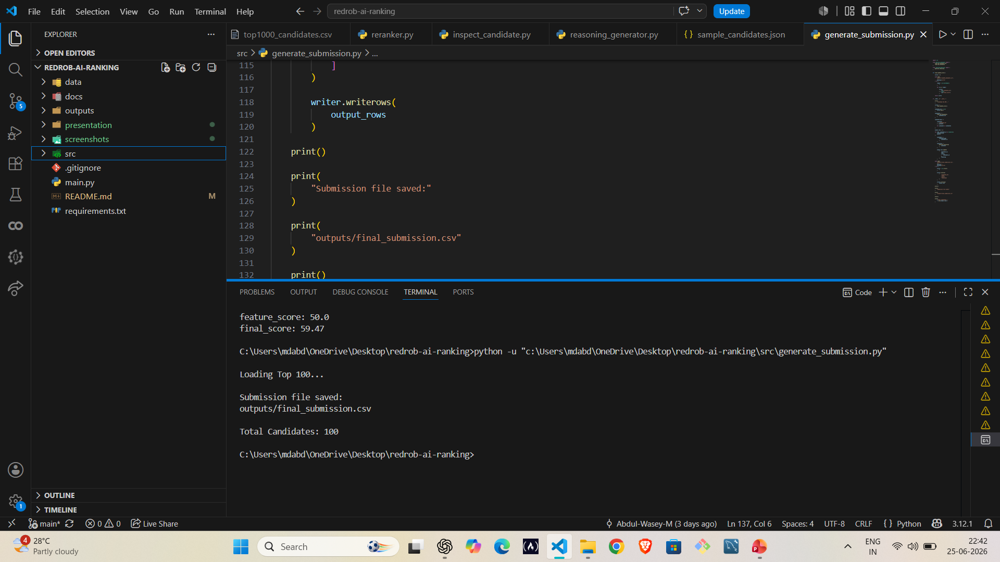
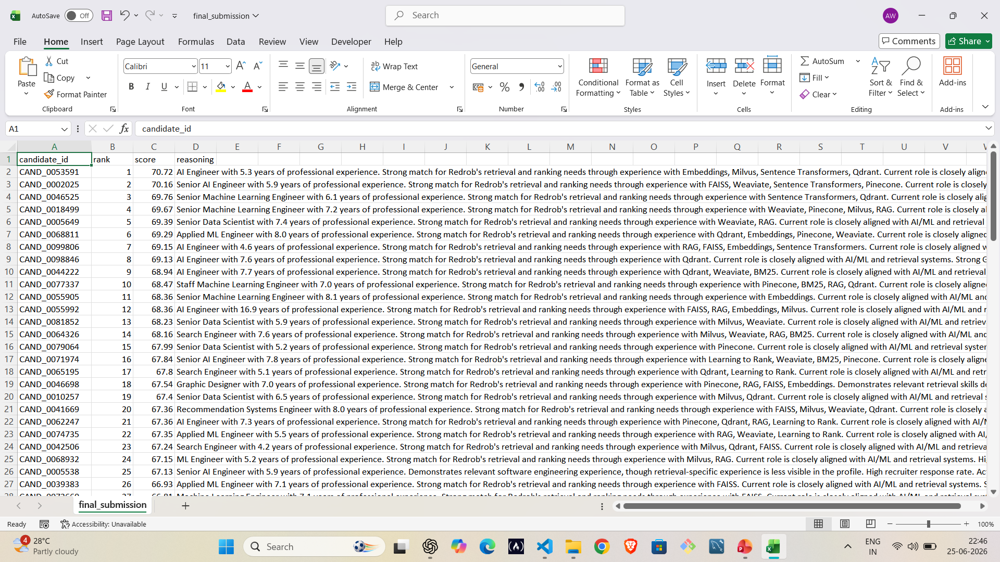

<div align="center">

# 🚀 Redrob AI Ranking System

### Explainable AI-Powered Candidate Ranking for Intelligent Hiring

Developed for the **Redrob Data & AI Challenge (Hack2Skill)**

<br>


</div>

---

# 📌 Project Overview

The **Redrob AI Ranking System** is an Explainable AI-powered candidate ranking solution developed for the Redrob Data & AI Challenge. The system intelligently matches candidate profiles against a Job Description (JD) using semantic retrieval, hybrid scoring, behavioural analysis, and consistency validation.

Unlike traditional Applicant Tracking Systems (ATS) that primarily rely on keyword matching, this solution understands the contextual relevance between candidate profiles and job requirements. It produces a transparent **Top 100 ranked candidate shortlist** with recruiter-friendly reasoning for every recommendation.

The project follows a modular architecture, making it scalable, maintainable, and suitable for processing large candidate datasets efficiently.
---

# 🎯 Problem Statement

Modern recruitment platforms receive thousands of applications for a single job opening. Traditional Applicant Tracking Systems (ATS) often rely on keyword matching, which can overlook qualified candidates whose skills and experience are described differently.

The objective of this project is to build an Explainable AI-powered candidate ranking system that understands the semantic meaning of both job descriptions and candidate profiles. The system retrieves the most relevant candidates, evaluates multiple ranking signals, and generates transparent, recruiter-friendly explanations for every recommendation.

---

# ✨ Key Features

* 🔍 Semantic candidate retrieval using Sentence Transformers
* 📐 Dense embedding-based similarity scoring
* 📊 Hybrid scoring using semantic, behaviour, and consistency signals
* 🧠 Explainable ranking with recruiter-friendly reasoning
* 🏆 Automatic Top 100 candidate ranking
* 📁 Submission-ready CSV generation
* 🏗️ Modular and scalable Python architecture
* 📈 Efficient processing of large candidate datasets
---

# 📸 Project Screenshots

## 🏗️ System Architecture

The complete end-to-end workflow of the AI-powered candidate ranking pipeline.

<p align="center">

</p>

---

## 💻 Pipeline Execution

Successful execution of the submission generation pipeline.

<p align="center">

</p>

---

## 📊 Final Submission Output

Generated submission containing the Top 100 ranked candidates with explainable reasoning.

<p align="center">

</p>

---
# 🏛️ System Architecture

The project follows a modular AI pipeline where each stage performs a specific task before passing the candidate profiles to the next component.

```
Job Description
      │
      ▼
 JD Parsing & Feature Extraction
      │
      ▼
 Semantic Candidate Retrieval
      │
      ▼
 Candidate Scoring
      │
      ▼
 Hybrid Score Aggregation
      │
      ▼
 Explainable Candidate Ranking
      │
      ▼
 Top 100 Submission Generation
```

Each module is independently implemented, making the pipeline scalable, reusable, and easy to maintain.

---
# 📂 Project Structure

```text
redrob-ai-ranking/
│
├── data/                 # Input datasets
├── docs/                 # Challenge documents
├── outputs/              # Final submission CSV
├── presentation/
│   ├── Redrob_AI_Ranking_Presentation.pptx
│   └── Redrob_AI_Ranking_Presentation.pdf
├── screenshots/          # README images
├── src/                  # Source code
│   ├── semantic_ranker.py
│   ├── behavior_score.py
│   ├── consistency_score.py
│   ├── final_ranker.py
│   ├── reasoning_generator.py
│   ├── generate_submission.py
│   └── ...
├── README.md
└── requirements.txt
```


---

# 🚀 Installation

## Clone the repository

```bash
git clone https://github.com/Abdul-Wasey-M/redrob-ai-ranking.git
cd redrob-ai-ranking
```

## Install dependencies

```bash
pip install -r requirements.txt
```

---

# ▶️ Usage

Run the submission generation pipeline:

```bash
python src/generate_submission.py
```

The generated submission file will be saved in:

```text
outputs/final_submission.csv
```

---
# 📊 Results

The system successfully processes candidate profiles, ranks them according to job relevance, and generates a submission-ready Top 100 candidate list.

### Generated Outputs

| File                     | Description                                      |
| ------------------------ | ------------------------------------------------ |
| `final_submission.csv`   |Original output generated by the pipeline         |
| `final_submission.xslx`  | Excel version prepared for Hack2Skill submission |
| `top100_candidates.csv`  | Top 100 ranked candidates                        |
| `top1000_candidates.csv` | Top 1000 ranked candidates                       |

Each shortlisted candidate includes:

* Candidate ID
* Rank
* Final Score
* Explainable Reasoning

---
# 📦 Submission Assets

| Asset | Description |
|--------|-------------|
| 📄 `presentation/Redrob_AI_Ranking_Presentation.pdf` | Final project presentation |
| 📊 `outputs/final_submission.csv` | Original submission generated by the ranking pipeline |
| 📈 `outputs/final_submission.xlsx` | Excel version prepared for Hack2Skill submission |
| 💻 `src/` | Complete implementation |
| 📸 `screenshots/` | Project screenshots |
| 📘 `README.md` | Project documentation |

---

# 🔮 Future Improvements

- Support multiple job descriptions
- Fine-tune embedding models for better retrieval
- Add configurable scoring weights
- Build an interactive web dashboard
- Deploy as an API for recruiter workflows

---
# 👨‍💻 Author

**Mohammed Abdul Wasey**

B.Tech – Computer Science & Engineering

Aspiring Data Analyst | Machine Learning Enthusiast

GitHub: <https://github.com/Abdul-Wasey-M>

LinkedIn: <https://www.linkedin.com/in/abdul-wasey-mohammed-108181212/>

---
# 📄 License

This project is protected under a custom **All Rights Reserved** license.

The source code is provided for evaluation, educational, recruitment, and portfolio purposes only.

Commercial use, redistribution, modification, or reuse of this code without prior written permission from the author is prohibited.

See the **LICENSE** file for full details.
---

# 🙏 Acknowledgements

This project was developed as part of the **Redrob Data & AI Challenge** hosted by **Hack2Skill**.

I would like to thank the organizers for providing the challenge, datasets, and evaluation framework, which made this project possible.
